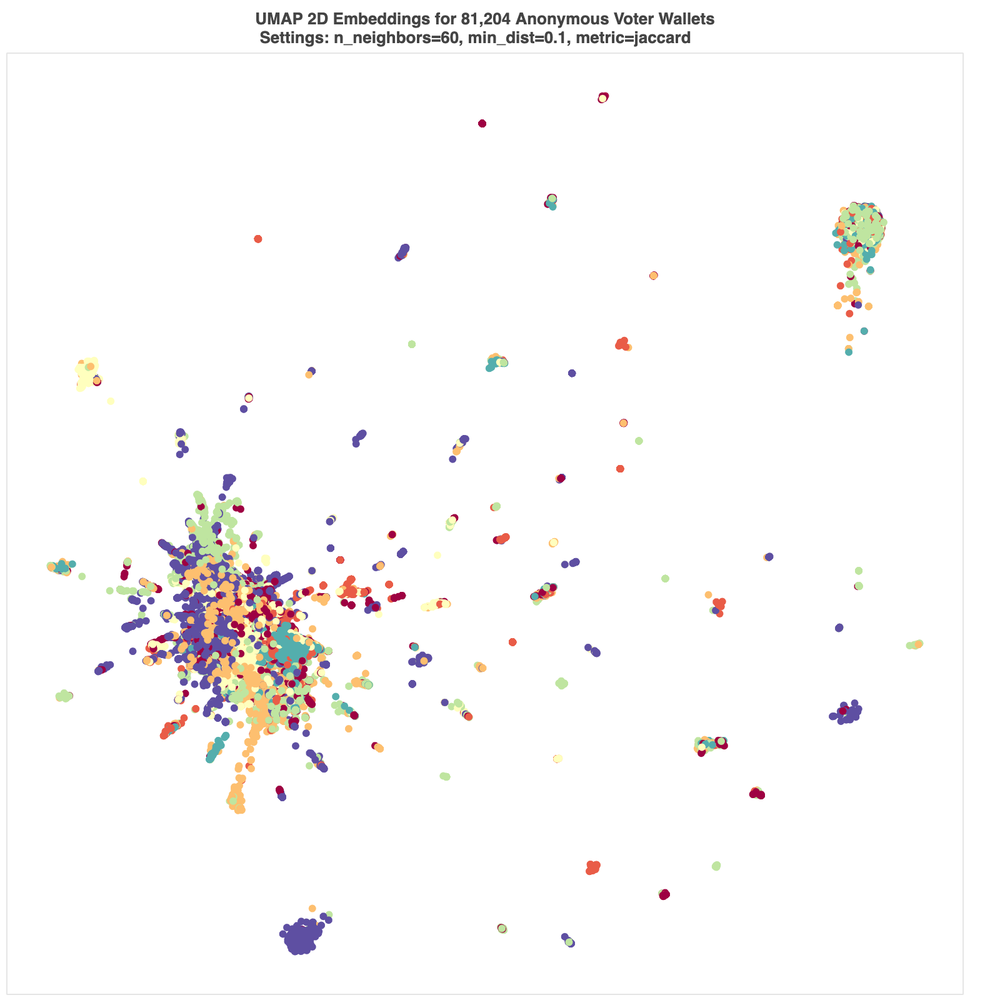

# WalletFingerprinting
A novel method to cluster unknown cryptocurrency addresses. 

From "New Online Communities: Graph Deep Learning on Anonymous Voting Networks to Identify Sybils in Polycentric Governance" [https://arxiv.org/abs/2311.17929](https://arxiv.org/abs/2311.17929)

We can use historical wallet balances to "fingerprint" voters. Using the `snapshot.org` API, we constructed a graph of voters for seven DAOs of varying sizes and augmented each voter with unique wallet token balances at the time of the vote. We used the Covalent Unified API to collect token tickers and their associated historical balances and attached these `coins' to each voter. From Figures **1** and **2**, we see many unique tokens in voter wallets and observe that voters share wallet token sets, with a long tail of shared, distinct voter sets. If we then dot plot the token sets and colormap their normalized values, we see clear evidence of extractable information for each wallet defined by the uniqueness of wallet token sets (Figure **3**).

Indeed, some token sets are highly individual, like the `anonymous' voter who owns a set of [REALTOKENS](https://realt.co/) (a form of tokenized, fractional property ownership) with specific addresses in Detroit, Michigan (see Figure **4**):

1. 18481 WESTPHALIA ST DETROIT MI
2. 9717 EVERTS ST DETROIT MI
3. 13895 SARATOGA ST DETROIT MI
4. 18466 FIELDING ST DETROIT MI
5. 15095 HARTWELL ST DETROIT MI
6. ...

More practically, we also analyze the wallet fingerprints using Uniform Manifold Approximation and Projection (UMAP), a manifold learning technique for dimensionality reduction. UMAP seeks to reduce \( D \) to a lower dimension \( d \), resulting in \( \mathbf{E}_{\text{reduced}} \in \mathbb{R}^{N \times d} \), while preserving the local and global structure of the data. While the UMAP algorithm is quite simple (it calculates nearest-neighbours to produce sets of weighted graphs, calculates probabilities for edges on a unified graph, and then uses a force algorithm to lay the graph out), the mathematical underpinnings are fascinating and much more complex [McInnes et al. (2020)](https://arxiv.org/abs/1802.03426). In a sentence, UMAP finds fuzzy simplicial sets (mathematical abstractions from category theory that involve objects and mappings), which define the metric between nodes (viz. Riemannian in that space is made of individually defined metrics, unlike Euclidean space); to display a high dimensional representation in low (2 or 3) dimensions, UMAP minimizes the cross-entropy between the high-dimensional fuzzy simplicial set and the _a priori_ low dimensional manifold.

To prepare our fingerprint dataset, we encode each voter's unique ticker set as a sparse matrix. We then fit the wallet's vector embeddings using a Jaccard metric with UMAP and construct an interactive 2D or 3D plot, which reveals features of the voter fingerprints (the interactive plot is too large to host on Github). Through experimentation we found that the Jaccard, cosine, and Manhattan metrics all work reasonably well with a default 15 neighbours, but Jaccard offered the best balance of local and global topology (see Figures **5** and **6**).

We then cluster the embeddings using Hierarchical Density-Based Spatial Clustering of Applications with Noise (HDBSCAN) and refit the embeddings with UMAP to visualize the results (see Figure **6**). Inspecting the plot is revealing; for instance, when tight, uniform clusters are far from others, we suspect the presence of Sybils (clusters reveal sets of users with a highly unique wallet fingerprint; see Figure **7**).

Finally, we train a simple deep neural network to learn each voter's wallet token fingerprint and predict the associated DAO. This shows that wallet sets contain important topological information. Indeed, our clustering results have an accuracy of 0.6, which is significantly better than random guessing (0.14) for seven classes, by 45.7%.

Specifically, given a dataset \( \mathcal{D} = \{(\mathbf{x}_i, y_i)\}_{i=1}^{N} \) where \( \mathbf{x}_i \in \mathbb{R}^{d} \) represents the input features of dimension \( d \) and \( y_i \) represents the labels. The dataset is divided into training, validation, and testing sets. Let \( f(\mathbf{x}; \theta) \) be the neural network function parameterized by \( \theta \).

The neural network, \( f(\mathbf{x}; \theta) \), is defined as follows:

1. The input layer takes \( d \)-dimensional input vector \( \mathbf{x} \).
2. The first linear transformation is applied: \( \mathbf{z}_1 = \mathbf{W}_1\mathbf{x} + \mathbf{b}_1 \), where \( \mathbf{W}_1 \in \mathbb{R}^{512 \times d} \) and \( \mathbf{b}_1 \in \mathbb{R}^{512} \).
3. A ReLU activation function is applied: \( \mathbf{a}_1 = \text{ReLU}(\mathbf{z}_1) \).
4. Batch normalization is applied to \( \mathbf{a}_1 \) before dropout: \( \mathbf{a}_1' = \text{BatchNorm}(\mathbf{a}_1) \).
5. Dropout is applied to \( \mathbf{a}_1' \) with a dropout rate of 0.5.
6. This process is repeated for additional layers with dimensions \( 512 \to 256 \to 128 \to 64 \), including linear transformations, ReLU activations, batch normalization, and dropout at each step. Specifically, for layer \( l \) where \( 2 \leq l \leq 5 \):

\[
\mathbf{z}_l = \mathbf{W}_l\mathbf{a}_{l-1}' + \mathbf{b}_l, \quad \mathbf{a}_l' = \text{Dropout}(\text{BatchNorm}(\text{ReLU}(\mathbf{z}_l)), 0.5)
\]

with \( \mathbf{W}_l \) and \( \mathbf{b}_l \) representing the weights and biases of layer \( l \), respectively.

7. The final layer's output \( \mathbf{z}_5 \) is passed through a linear transformation without a subsequent activation or dropout for the classification: \( \hat{\mathbf{y}} = \mathbf{W}_5\mathbf{a}_4' + \mathbf{b}_5 \), where \( \mathbf{W}_5 \in \mathbb{R}^{\text{num\_classes} \times 64} \) and \( \mathbf{b}_5 \in \mathbb{R}^{\text{num\_classes}} \).

He initialization is applied to all linear layers, ensuring variance scaling is maintained in the network's activations. The network is trained using the cross-entropy loss function:

\[
\mathcal{L}(\theta) = -\frac{1}{N} \sum_{i=1}^{N} \log \frac{e^{\hat{y}_{i,y_i}}}{\sum_{j=1}^{\text{num\_classes}} e^{\hat{y}_{i,j}}}
\]

where \( \hat{y}_{i,j} \) is the \( j \)-th element of the network's output \( \hat{\mathbf{y}}_i \) for input \( \mathbf{x}_i \), and \( y_i \) is the true label of \( \mathbf{x}_i \).

Optimization is performed using the Adam optimizer with a learning rate of \( 0.001 \) and weight decay of \( 1e-5 \) for regularization, and the model is evaluated using a split of training, validation, and testing data.

After training, the dimensionality of embeddings is once again reduced using UMAP for inspection. We see structure, but the results are of limited value (see Figure **8**). Instead, we cluster these high dimensional embeddings using a Random Forest classifier (see Figure **9**).

The resulting clusters can be evaluated against the true labels with a confusion matrix (Figure **10**). Additionally, we computed cluster evaluation metrics (see Table **1**).

| Class | Precision | Recall | F1-Score | Support |
|-------|-----------|--------|----------|---------|
| 0     | 0.52      | 0.28   | 0.37     | 193     |
| 1     | 0.60      | 0.60   | 0.60     | 163     |
| 2     | 0.46      | 0.38   | 0.42     | 378     |
| 3     | 0.44      | 0.38   | 0.41     | 245     |
| 4     | 0.60      | 0.67   | 0.63     | 668     |
| 5     | 0.47      | 0.36   | 0.41     | 66      |
| 6     | 0.61      | 0.72   | 0.66     | 724     |

Accuracy: 0.5650 (2437 samples)  
Macro avg: 0.53 precision, 0.48 recall, 0.50 F1-score  
Weighted avg: 0.55 precision, 0.57 recall, 0.55 F1-score  

**Table 1: Clustering Evaluation Metrics**

While there remains much room for methodological improvement, our analysis reveals the predictive power of wallet token fingerprinting.
